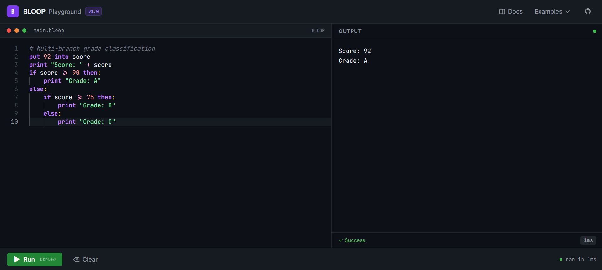

# 🟣 BLOOP Playground

An online playground for **BLOOP** — a tiny, indentation-based toy programming language.  
Write and run BLOOP programs right in your browser, no installation needed.

> **Live demo:** _https://bloop-lang-interpreter.vercel.app_



<!-- Replace the line above with an actual screenshot once deployed -->

---

## ✨ Features

- **Monaco Editor** with full BLOOP syntax highlighting and autocomplete
- **Instant execution** — code runs on a Spring Boot backend in milliseconds
- **6 built-in examples** covering all language features
- **Language reference docs** accessible from the header
- `Ctrl+Enter` / `Cmd+Enter` keyboard shortcut to run code
- Hard **5-second timeout** and **10,000-character output cap** for safety
- Fully CORS-enabled for cross-origin Vercel ↔ Render communication

---

## 🏗 Project Structure

```
bloop-playground/
├── docker-compose.yml        # Local dev with Docker
├── README.md
├── backend/
│   ├── Dockerfile            # Multi-stage Maven → JRE build
│   ├── pom.xml               # Spring Boot 3.x, Java 17
│   ├── render.yaml           # Render deployment config
│   └── src/main/java/
│       ├── com/bloop/        # Spring Boot app, API, service
│       ├── interpreter/      # Modified Interpreter.java
│       ├── tokens/           # Unchanged tokenizer
│       ├── parser/           # Unchanged parser
│       ├── Nodes/            # Unchanged AST nodes
│       ├── Instructions/     # Unchanged instruction classes
│       └── environment/      # Unchanged variable store
└── frontend/
    ├── Dockerfile            # Node build → Nginx serve
    ├── vercel.json           # Vercel deployment config
    ├── vite.config.js        # Vite + dev proxy
    └── src/
        ├── App.jsx           # Root layout
        ├── components/       # Editor, OutputPanel, Toolbar, modals
        ├── constants/        # Examples and docs content
        └── hooks/            # useRunBloop fetch hook
```

---

## 🚀 Local Development

### Option A — Docker (recommended, zero setup)

```bash
# Clone the repo
git clone https://github.com/manojk909/bloop-playground.git
cd bloop-playground

# Build and start both services
docker compose up --build

# Frontend → http://localhost:3000
# Backend  → http://localhost:8080
```

### Option B — Without Docker

**Prerequisites:** Java 17+, Maven 3.8+, Node.js 20+

```bash
# 1. Start the backend
cd backend
mvn spring-boot:run
# API available at http://localhost:8080

# 2. In a separate terminal, start the frontend
cd frontend
npm install
npm run dev
# App available at http://localhost:3000
```

---
## 📖 BLOOP Language Cheatsheet

### Variables

```bloop
put 42 into x
put "hello" into name
put x + 1 into x
```

### Print

```bloop
print x
print "Hello, " + name
print 3 + 4
```

### Arithmetic

```bloop
put 10 + 3 into a      # 13
put 10 - 3 into b      # 7
put 10 * 3 into c      # 30
put 10 / 3 into d      # 3.333...
put 2 + 3 * 4 into e   # 14  (* before +)
```

### String Concatenation

```bloop
print "Score: " + score     # numbers auto-convert to string
print "Hi " + "there"
```

### Comparisons

| Operator | Meaning          |
| -------- | ---------------- |
| `==`     | equal            |
| `!=`     | not equal        |
| `>`      | greater than     |
| `<`      | less than        |
| `>=`     | greater or equal |
| `<=`     | less or equal    |

### If / Else

```bloop
if score > 80 then:
    print "Pass"
else:
    print "Fail"
```

`else` is optional. Blocks are delimited by indentation.

### Repeat Loop

```bloop
repeat 5 times:
    print "hello"

put 3 into n
repeat n times:
    print "loop"
```

### Nesting

```bloop
repeat 5 times:
    if x > 0 then:
        print "positive"
    put x - 1 into x
```

### Comments

```bloop
# This is a comment
put 5 into x    # inline comment
```

### Error Handling

- Parse/runtime errors are returned in `stderr` (shown in red in the UI).
- Programs that exceed **5 seconds** are killed; output returns a timeout message.
- Output is capped at **10,000 characters** to prevent flooding.

---

## 🏛 Architecture

```
Browser (Vercel)          Backend (Render / Docker)
┌────────────────┐        ┌─────────────────────────────┐
│  React + Vite  │        │  Spring Boot 3.x (Java 17)  │
│  Monaco Editor │──POST──▶  POST /api/run              │
│  Tailwind CSS  │◀──JSON─│    BloopService              │
└────────────────┘        │    ├─ 5s timeout             │
                          │    ├─ 10k char cap           │
                          │    └─ OutputCapture (TL)     │
                          │  Interpreter pipeline:       │
                          │    Tokenizer → Parser        │
                          │    → Instructions → Env      │
                          └─────────────────────────────┘
```

---

## 🤝 Contributing

Pull requests welcome! The interpreter lives in `backend/src/main/java/` under the `tokens`, `parser`, `Nodes`, `Instructions`, `interpreter`, and `environment` packages. The Spring Boot wrapper is in `com/bloop/`.
